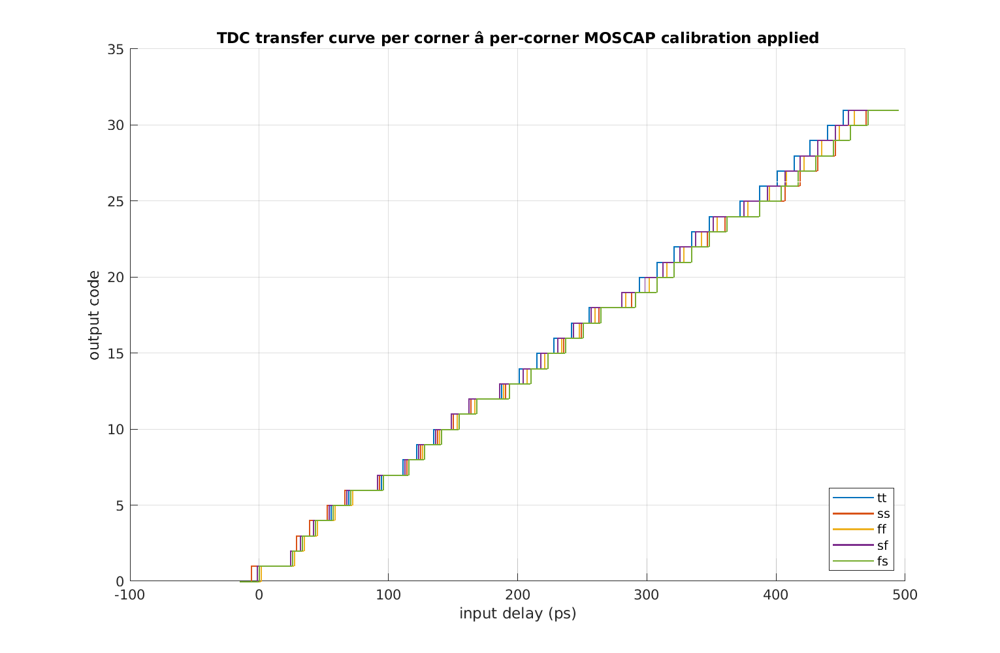
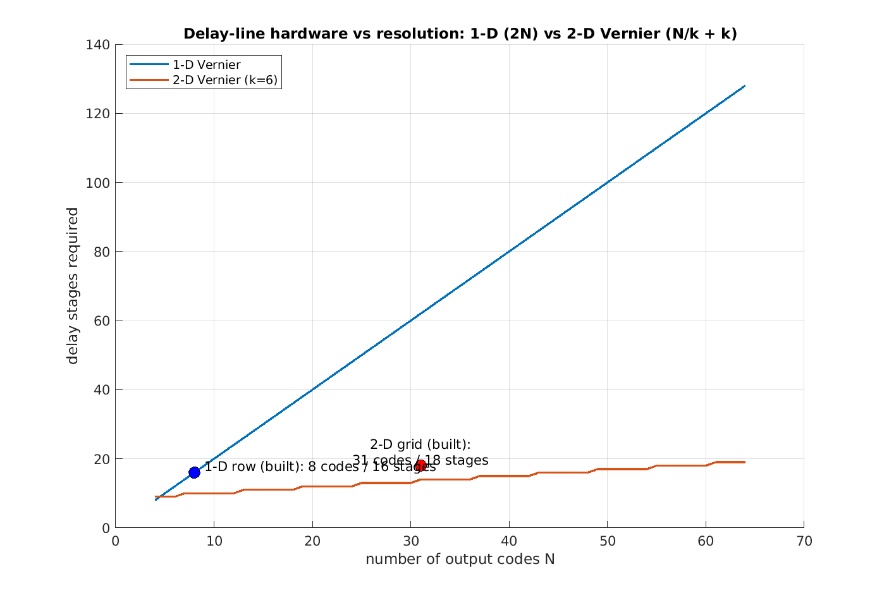
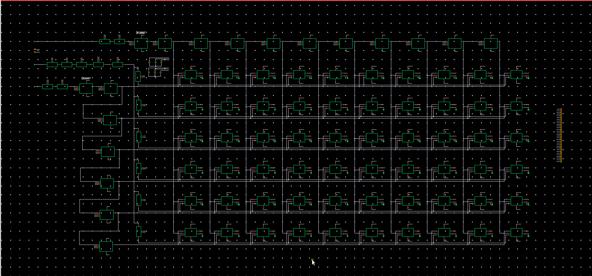
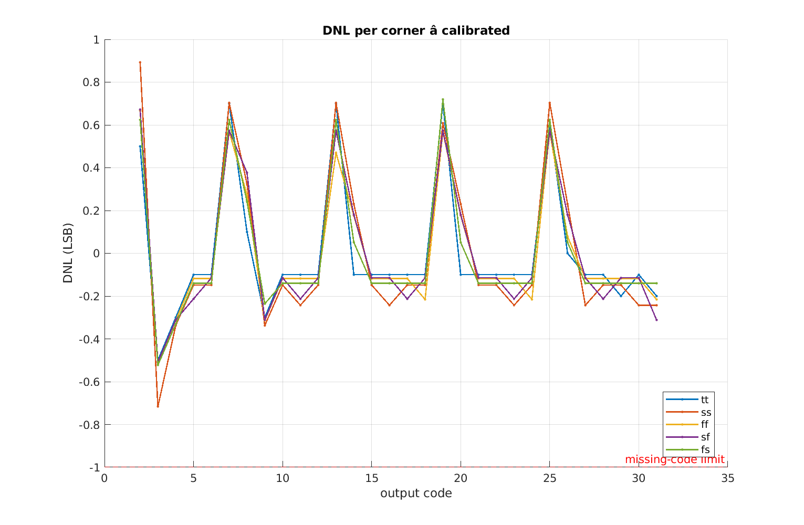
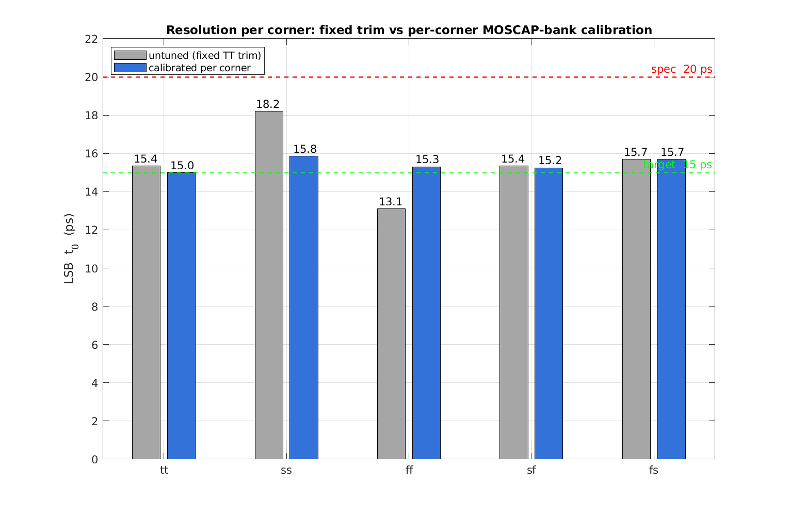

# A 15 ps 2-D Vernier Time-to-Digital Converter in 180 nm BCD


A full-custom, **5-bit Time-to-Digital Converter (TDC)** that digitizes the time
difference between two rising edges with a **15 ps least-significant bit** — finer
than a single inverter delay in this process. Built for TU Delft **EE4615 — Digital
IC Design II** (Group 22), every transistor was sized by hand in **TSMC 180 nm BCD**;
no standard cells were used. The design is verified across all five process corners
in Cadence Spectre.

> 📄 **[Full design report (PDF)](report/TDC22-Tyukov-Hoogeweegen-report.pdf)** · [architecture notes](project-details/01-architecture.md) · [spec sheet](project-details/02-specs.md)

<p align="center">
  
  <br><em>Measured transfer characteristic — a monotonic 0→31 code staircase, overlaid for all five corners after per-corner trim.</em>
</p>

---

## Headline results

| Metric | Result | Requirement |
|---|---|---|
| Resolution (LSB, $t_0$) | **15.0 – 15.85 ps** (calibrated) | < 20 ps |
| Output | 5-bit, 31-code thermometer | 5-bit |
| Process corners | **5 / 5 PASS** (TT, SS, FF, SF, FS) | all 5 |
| Missing codes | **none** — DNL > −1 LSB everywhere | DNL > −1 LSB |
| Linearity | DNL ≤ 0.9 LSB, INL ≤ 1.0 LSB | reported |
| LSB corner spread | **5.1 ps → 0.85 ps** with trim (**6× tighter**) | — |
| Effective resolution | **ENOB ≈ 4.4 – 4.6 bits** | — |
| Energy / conversion | ≈ 11 – 13 pJ | reported |
| Arbiter dead zone | **< 1 fs** (≪ LSB); regen. $\tau \approx 24$ ps | characterized |

All numbers from 5-corner Spectre sweeps at 1.8 V — see [`results/`](results/).

---

## The idea: trading area for resolution, in two dimensions

A **Vernier TDC** races the START edge down a slow delay line ($\tau_1$ per stage)
against the STOP edge down a fast one ($\tau_2 < \tau_1$). An array of arbiters
records which edge wins at each tap, so the effective resolution is the *difference*
of two delays:

$$t_0 = \tau_1 - \tau_2$$

This beats the inverter delay — but a **1-D** line needs one stage *per code*, so
area and latency grow linearly with range. A **2-D Vernier** instead arranges the
START and STOP taps on a grid: cell $(i,j)$ resolves a unique time

$$\Delta t_{i,j} = i\,\tau_1 - j\,\tau_2$$

so $N_X + N_Y$ delay stages cover $\sim\tfrac{1}{2}N^2$ codes. For our 32-code
converter that is a **10×6 logical grid from 16 delay stages** instead of 64 — a
**~4× cut in delay cells**, and the gap widens with resolution:

<p align="center">
  
  <br><em>Why 2-D: delay-line hardware vs. resolution. The built 1-D row and 2-D core are marked; extrapolated to 31 codes the 1-D line needs 3.4× the stages and 3.7× the latency.</em>
</p>

The cost is more arbiters and tighter routing — the engineering trade this project
exists to explore.

---

## Inside the chip

The core is a grid of **NAND-based SR-latch arbiters** fed by two
capacitively-loaded inverter delay lines. A bijective $k=6$ routing map sends one
latch straight to each thermometer bit — **no OR-tree, no combining logic**. The
grid is dummy-padded to 10×10 so every delay tap sees identical fan-out, which is
what keeps linearity flat across corners.

<p align="center">
  
  <br><em>The TDC core in Cadence Virtuoso: two Vernier delay lines (top-left START, left STOP) driving the 10×10 arbiter grid.</em>
</p>

**Key design decisions** (full rationale in [`project-details/`](project-details/)):

| Choice | Value | Why |
|---|---|---|
| Resolution $t_0$ | 15 ps | 5 ps margin under the 20 ps cap |
| Delays $\tau_1 : \tau_2$ | 90 : 75 ps ($k=6$) | sets the bijective routing map |
| Grid | 10×6 logical / 10×10 physical | dummy-padded for equal fan-out |
| Arbiter | NAND SR latch + async reset | chosen over D-FF; metastable dead zone characterized |
| Delay cell | FO=1 cap-loaded inverter | opened a usable 74–147 ps tuning window |
| Calibration | transmission-gate MOSCAP banks | holds $\tau_1 - \tau_2$ flat across PVT |

---

## Verification highlights

<table>
<tr>
<td width="50%">

<em>DNL stays inside ±1 LSB in every corner — no missing codes. The period-6 sawtooth is the architectural column-wrap, identical across corners.</em>
</td>
<td width="50%">

<em>Per-corner MOSCAP trim collapses the LSB spread from 5.1 ps to 0.85 ps without changing a single device.</em>
</td>
</tr>
</table>

The SR-latch arbiter was separately characterized for **metastability**: the
decision dead zone is below 1 fs — more than four orders of magnitude under the
15 ps LSB — with a 24 ps regeneration time constant
([`results/metastability/`](results/metastability/)).

---

## How it was built

- **Schematic + Spectre only** (no layout) in **Cadence IC 23.10** on TU Delft's
  remote server, driven over SSH/X11 from the scripts in this repo.
- **OCEAN** scripts run the parametric input-delay sweep that produces each
  staircase, then post-process to LSB / DNL / INL / energy / FoM in MATLAB and
  Python ([`results/*/plot_*.m`](results/), [`sum_width.py`](results/corners/sum_width.py)).
- **Reproducible corner runs** via [`run-testbench.sh`](run-testbench.sh) →
  results land in [`results/`](results/).

---

## Repository layout

```
.
├── project-details/        # design docs: architecture, specs, testbench, plan, references
├── report/                 # LaTeX design report (+ compiled PDF) and all figures
├── results/                # 5-corner sweeps, calibration, 1-D vs 2-D, metastability
│   ├── corners/            #   fixed-trim corner sweep
│   ├── tuned_corners/      #   per-corner MOSCAP calibration
│   ├── vernier1d_vs_2d/    #   architectural comparison
│   └── metastability/      #   SR-latch arbiter characterization
├── vernier2d/              # exported Cadence cellviews (delay cells, SR latch, core)
├── sch_figs/               # block diagrams and schematic figures
├── tesbench-pics/          # supplied Testbench cell map + extracted schematics
├── Testbench_180nm_tech_2026/   # course-supplied Cadence Testbench library
├── tutorials/              # official EE4615 PDFs (workflow source of truth)
│
├── first-time-setup.sh     # idempotent bootstrap of the remote environment
├── launch-cadence.sh       # open Virtuoso over SSH X11
├── run-testbench.sh        # run the OCEAN corner sweep and pull results back
├── mount-tsmcBCD.sh        # sshfs the remote PDK working dir
└── register-library.sh     # register new libraries in cds.lib
```

## Running the flow

Cadence lives on the TU Delft server `ee4615.ewi.tudelft.nl`; the scripts here drive
it. Credentials are read from a gitignored `password_username.txt`
(`login:` / `password:` lines).

```bash
./first-time-setup.sh            # one-time: upload Testbench, make dirs, register cds.lib
./launch-cadence.sh              # open Cadence Virtuoso over SSH X11
./run-testbench.sh thermometer   # run the OCEAN sweep → results/  (or: binary)
```

---

## Authors

**Group 22** — Daniel Tyukov · Joris Hoogeweegen
TU Delft, MSc Electrical Engineering · EE4615 Digital IC Design II · June 2026
</content>
</invoke>
